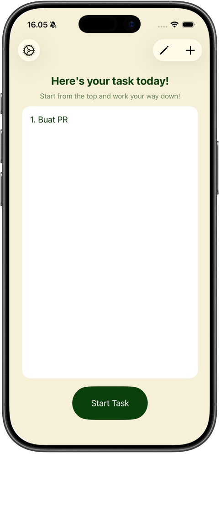
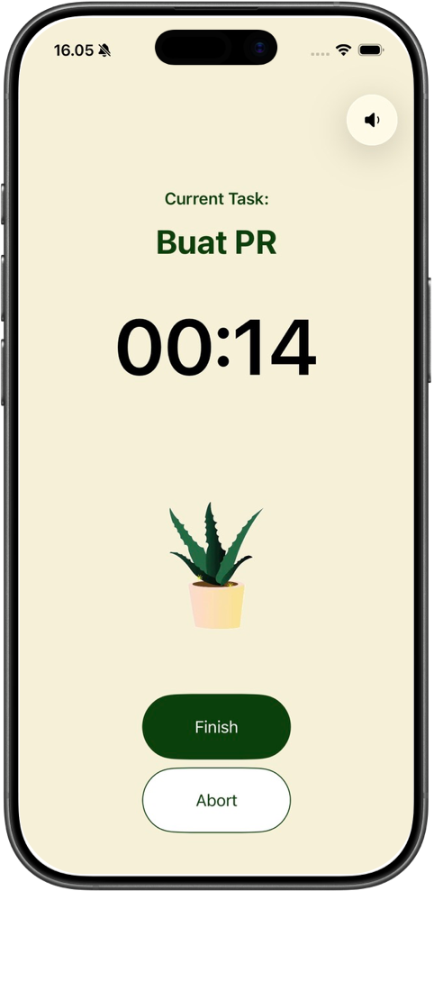
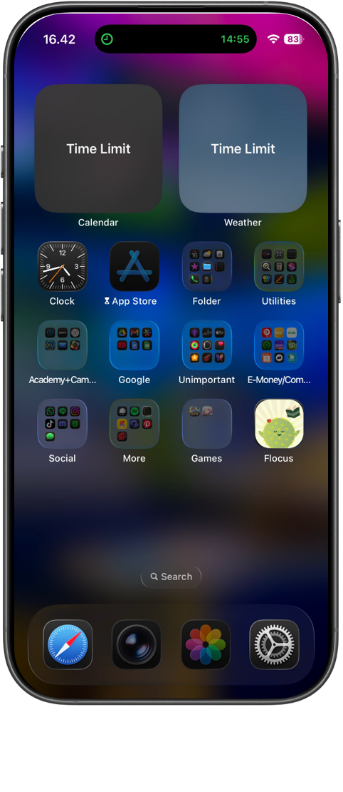
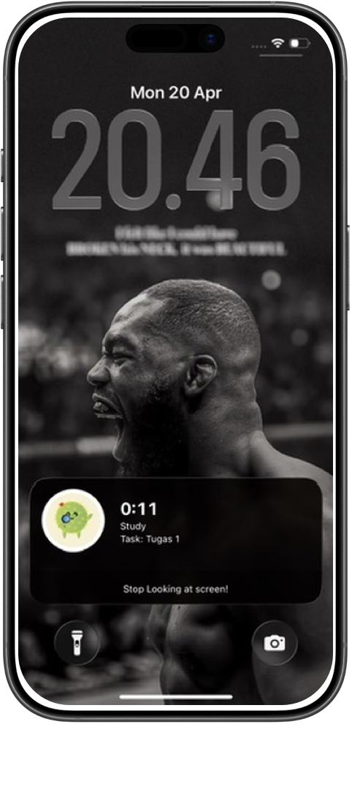
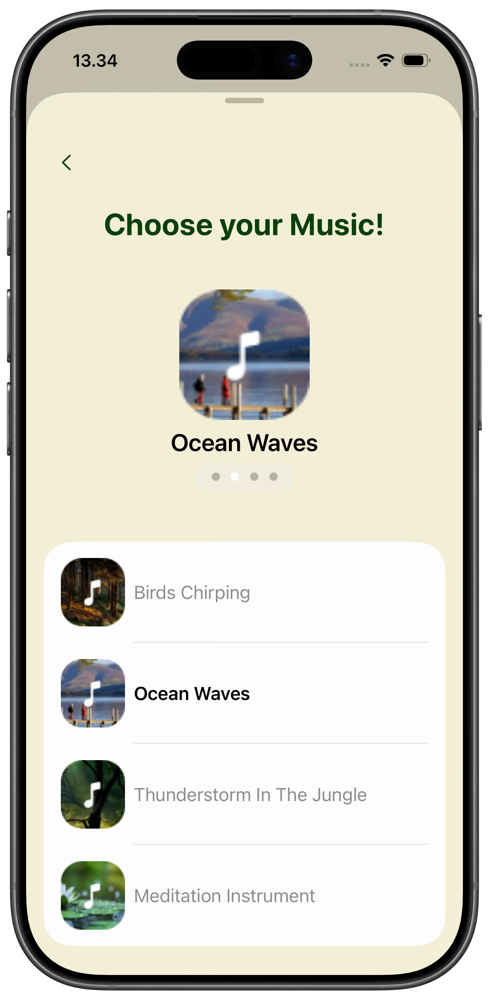
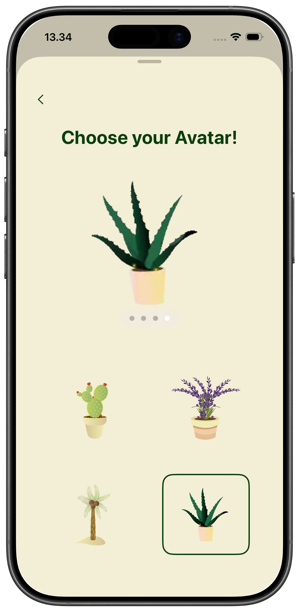

# Flocus

Flocus is a productivity app with one goal: get things done. It's Pomodoro on steroids instead of just running a timer, Flocus guides you through your task list one task at a time, top to bottom, and won't let you off the hook until each one is finished. During your session, it locks down distracting apps using Apple Family Controls so your phone works for you, not against you. You stay in control by choosing exactly which apps to allow.

---

## Features

- **Single-task focus** — Work through your task list sequentially, top to bottom. No jumping around.
- **Pomodoro timer** — Customizable focus sessions (15–45 min) followed by automatic 10-minute breaks.
- **App locking with Family Controls** — Blocks distracting apps during focus sessions. You choose which apps to allow.
- **Live Activities** — Timer countdown displayed on the Dynamic Island and Lock Screen in real time.
- **Task management** — Add, edit, delete, and reorder tasks. Tasks are completed in order and tracked with persistent storage.
- **Nature avatars** — Choose from 4 animated plant avatars (Cactus, Lavender, Palm Tree, Snake Plant) powered by Lottie.
- **Background music** — Pick from 4 nature soundscapes: Birds Chirping, Ocean Waves, Thunderstorm in the Jungle, or Meditation Instrument.
- **Abort & early break** — Hold to abort a session, or skip ahead before your break ends.

---

## Screenshots

| Home | Focus | LockScreen |
|:----:|:-----:|:----------:|
|  |  |  |

| Live Activity | Choose Music | Choose Avatar |
|:-------------:|:------------:|:-------------:|
|  |  |  |

---

## Tech Stack

- **SwiftUI** + **SwiftData** — UI and local persistence
- **ActivityKit** + **WidgetKit** — Live Activities on Dynamic Island and Lock Screen
- **FamilyControls** + **ManagedSettings** — App blocking during focus sessions
- **AVFoundation** — Background music playback
- **Lottie** — Avatar animations

